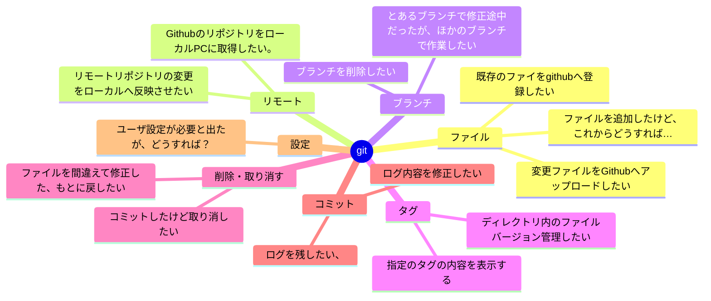

![[y-1.svg]]

- ファイル
	- 既存のファイをgithubへ登録したい
	- ファイルを追加したけど、これからどうすれば…
- リモート
	- リモートリポジトリの変更をローカルへ反映させたい
	- GithubのリポジトリをローカルPCに取得したい。
- ブランチ
	- とあるブランチで修正途中だったが、ほかのブランチで作業したい
	- ブランチを削除したい
- タグ
	- ディレクトリ内のファイルバージョン管理したい
	- 指定のタグの内容を表示する
- 削除・取り消す
	- ファイルを間違えて修正した、もとに戻したい
	- コミットしたけど取り消したい
- ログ
	- ログを残したい、
	- ログ内容を修正したい
- 設定
- ユーザ設定が必要と出たが、どうすれば？
### 既存のファイをgithubへ登録したい
まずはGithub上で空のリポジトリを作成する。
最初からGithubへ登録したい場合、
```
cd <directory>
git init
git branch -M main
git add .
git commit -m "init"
git remote add origin <Githubリポジトリ>
git push origin main
```
途中からからGithubへ登録したい場合、
```
cd <directory>
git branch -M main
git remote add origin <Githubリポジトリ>
git push origin main
```
#init #add #branch #remote #push #commit #push

### ファイルを追加したけど、これからどうすれば…
```sh
git add <追加フィル>
git commit -m "init" <追加ファイル>
```
#add #commit

### 変更ファイルをGithubへアップロードしたい

```sh
git push
```
#push

### リモートリポジトリの変更をローカルへ反映させたい
```sh
# リモートの「main」ブランチ → ローカルの「origin/main」ブランチ
git fetch
# 今いる作業中のブランチにリモートリポジトリの情報を反映
git pull
```

### GithubのリポジトリをローカルPCに取得したい。
```
git clone <リポジトリURL>
# Commit履歴が必要ない場合(ファイルサイズ小、ダウンロード時間短)
git clone --depth 1 <リポジトリURL>
```

### とあるブランチで修正途中だったが、ほかのブランチで作業したい
```
git stash push <メッセージ>
git checkout -b <別のブランチ>
...
いろいろ作業
git checkout -b <元のブランチ>
git stash pop
```
サブコマンドsave/applyの組み合わせでもOK.
#stash

### ディレクトリ内のファイルバージョン管理したい
タグをつける。
```
git tag -a <タグ名> -m <タグのコメント>
git push origin <タグ名>
# これまでのタグ一覧を表示する
git tag
# 指定のタグの内容を表示する
git show <タグ名>
```

### 修正の影響を受けないようbranch(枝)を作って、そのbranchで履歴を管理できる.

```
# issueというbranchを作成(commitされていない状態だとエラーになります)
git branch issue
# 実際にissueというbranchで作業するときはcheckoutする必要がある。
git checkout -b issue
```
ファイルを追加した場合は、
```
git add <ファイル名>
git commit -m "コメント" <ファイル名>
```
修正した場合は、
```sh
git commit -m "コメント" <ファイル名>
```
削除した場合は、
```
git rm <ファイル名>
```

### タグとしてバージョン番号を付与して管理する。
バージョン番号のルールは[セマンティック バージョニング 2.0.0 | Semantic Versioning](https://semver.org/lang/ja/)などを参照して付与する。
## 前の操作を取り消したい

### ファイルを間違えて修正した、もとに戻したい
```sh
git checkout <ファイル名>
```
#checkout
### コミットしたけど取り消したい
```sh
git log --oneline # コミットID表示
git revert <コミットID>
```
#revert
## 修正したい

### ログ内容を修正したい
直前のコミットログが修正できます。
```
git commit --amend -m "init2"
```
## ログってどう書けば…
[Conventional Commits](https://www.conventionalcommits.org/ja/v1.0.0/)
[Git のコミットメッセージに Semantic Commit Messages のテンプレートを追加する - hiroaki's blog](https://hiro14aki.hatenablog.com/entry/2020/11/27/115626)
#commit

## ブランチを削除したい
```sh
git branch -d <branch名>
```
#branch

## GithubのリポジトリをGitで管理したまま取得したい
```sh
git clone ...
```
## ユーザ設定が必要と出たが、どうすれば？
```
git config --global user.name "お名前"
git config --global user.email <emalアドレス>
```
#config
## 一人開発だけど、みんなと同じようにしたい
1. GitHub上でissueを立てる
Githubのリポジトリで`Issues`をクリック
![[Pasted image 20241014205617.png]]
`New issue`をクリック
![[Pasted image 20241014205754.png]]
`Issue`を記載する。Markdown形式で記載できる。
![[Pasted image 20241014210018.png]]
またわかりやすいラベル付与が右側`Labels`クリックで選択できる。あとから付与することも可能。ついでに`Assignees`で担当者をアサインする(まぁ自分だけど…)。
![[Pasted image 20241014205923.png]]

3. issue用のブランチを切る
`Issue`画面で`Development`で`Create a branch`をクリックしてこの`issue`ようのブランチを作成する
![[Pasted image 20241014211454.png]]

ローカルで次のコマンド実行.
```
git fetch origin
git checkout 1-readmeを充実する
```
5. 実際に作業する
```
vi README>
git commit -m "update doc for 1-issue" README.md
```
7. 作業が終わったらissue用ブランチをgit pushする
8. git pushされたデータを元に親ブランチにプルリクエストを出す
`push`後、リポジトリ画面で、`Compare & pull request'が出現する。`Compare & pull request`をクリックする
![[Pasted image 20241014213212.png]]

![[Pasted image 20241014213613.png]]
どうやら修正ファイルで`conflict`がおきてしまったようだ。`Resolve conflicts`をクリック
![[Pasted image 20241014213737.png]]
`Conflict`部分が表示される。

- [GitHub でのマージ コンフリクトを解決する - GitHub Docs](https://docs.github.com/ja/pull-requests/collaborating-with-pull-requests/addressing-merge-conflicts/resolving-a-merge-conflict-on-github)
![[Pasted image 20241014213906.png]]
競合マーカー `<<<<<<<`、`=======`、`>>>>>>>` を削除し、最終的なマージで必要な変更を行います。完了したら`Mark as resolved`をクリック。最後に`Commit merge`をクリック
![[Pasted image 20241014214845.png]]
`Merge pull request`をクリック
![[Pasted image 20241014214952.png]]
`Confirm merge`をクリック
![[Pasted image 20241014215221.png]]
`Pull request`が完了した。不要なブランチを削除するため`Delete branch`をクリック。自動的にissueはクローズとなる。

- [すべての Issue およびPull Requestを見る - GitHub Docs](https://docs.github.com/ja/issues/tracking-your-work-with-issues/using-issues/viewing-all-of-your-issues-and-pull-requests)

9. GitHub上でプルリクエストをmergeしてissue用ブランチを削除する
10. ローカルで親ブランチをgit fetchしてmergeする
11. GitHub上でissueを閉じる
#isuue #pull-request

## 参考文献
- [自動生成リリース ノート - GitHub Docs](https://docs.github.com/ja/repositories/releasing-projects-on-github/automatically-generated-release-notes)
- [GitHub Projects を使用してissueとpullRequestの見える化に取り組んだ話｜いしま](https://note.com/ishimas/n/nf525b55f0223)
- [GitHub Actions + GitHub CLIだけでリリースノートを自動生成する - TENTIALのテックブログ](https://tech.tential.jp/entry/2023/12/19/152942)
- [［GitHub］一人開発でもissueベース/セルフプルリクエストを使って開発する #個人開発 - Qiita](https://qiita.com/braveryk7/items/5208263cd06a8878f0c2)
- [GIT Branch and its Operations. - An Easy Understanding - Digital Varys](https://digitalvarys.com/git-branch-and-its-operations/#:~:text=In%20easy%20words%2C%20GIT%20branch%20is%20the%20local,merged%20with%20the%20main%20codebase%20once%20after%20verified.)
