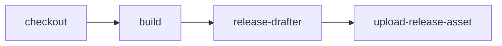

GitHub Actionsは、ビルド、テスト、デプロイのパイプラインを自動化できる継続的インテグレーションと継続的デリバリー（CI/CD）プラットフォームです。




### Community
Github Actionsのツールがいろいろ公開されています。

- [新Github Actions を使って npm audit fix と PR 作成を自動化してみた #Node.js - Qiita](https://qiita.com/shimosyan/items/947dffc7fbce6e67c311)
- [GitHub - JamesRobertWiseman/pnpm-audit](https://github.com/JamesRobertWiseman/pnpm-audit)
  この GitHub Action は、あなたのリポジトリに対して PNPM 監査を実行し、一定レベルの脆弱性を含むプルリクエストにコメントを付けます。
```yaml
    - name: NPM Audit & Comment
    uses: JamesRobertWiseman/pnpm-audit@v2
    with:
        github_token: ${{ secrets.GITHUB_TOKEN }}
        level: critical
        fails: true
```
## Marketplace

- [Marketplace · GitHub](https://github.com/marketplace?type=actions)
  タスクを簡素化し、プロセスを自動化するためのコミュニティとパートナーのツール
	- [npm audit action · Actions · GitHub Marketplace · GitHub](https://github.com/marketplace/actions/npm-audit-action)
## 参考文献
- [GitHub Actions で Visutal Studio 2022 の VC (Hello World) プロジェクトをコンパイル #GitHubActions - Qiita](https://qiita.com/bakachou/items/23c62606c69a6ffcdcae)
- [GitHub Actionsでビルドしたファイルをリリースノートに格納する](https://zenn.dev/sui_water/articles/7e7ccabdc5b8f5)
- [GitHub Actions を使ってリリース時のあれこれを自動化する](https://zenn.dev/itizawa/articles/b832c4e2a33661)
- [GitHub - actions/upload-artifact](https://github.com/actions/upload-artifact)
- [github actionsのartifactsを使ってuploadしたファイルを別jobで呼び出す](https://zenn.dev/jordan/articles/b6c1e905adab31)
- [GitHub ActionでVisualC++をGoogleTestとCppcheckを自動化する | ピカログ！](https://piccalog.net/entry/devops-github-action)
- [GitHub Actions で簡単にバージョン番号付きリリースとリリースノートを作成する方法](https://zenn.dev/kounoike/articles/20220211-easy-generate-release-notes)
- [【初心者向け】【入門】GitHub Actionsとは？書き方、デバッグ設定、runs-onやcheckoutなどの仕組みや構造も含めて徹底解説 #Linux - Qiita](https://qiita.com/shun198/items/14cdba2d8e58ab96cf95)
- [GitHub ActionsでWorkFlowやJobを連鎖させる方法 #GitHubActions - Qiita](https://qiita.com/masato_makino/items/f8cf20f3d0025d15bac8)
- [GitHub Actions - Workflowを連鎖させてみる](https://zenn.dev/umatoma/articles/9e68478dc81cd1)
- [GitHub Actionsで別リポジトリのワークフローを呼び出す](https://zenn.dev/kitoketa/articles/1a3ef4426dfe31)
- [ワークフロー状態バッジの追加 - GitHub Docs](https://docs.github.com/ja/actions/monitoring-and-troubleshooting-workflows/monitoring-workflows/adding-a-workflow-status-badge)
- [GitHub Actionsのバッジをリンク付きでREADMEに追加する #GitHubActions - Qiita](https://qiita.com/akameco/items/e474691964703033e18d)
- 