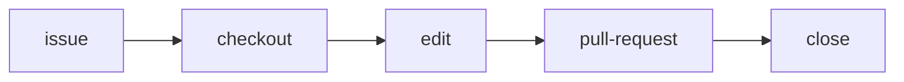

課題(バグ・機能など)を`issue`として作成、対応するブランチ上で編集作業して、その内容を`commit`,`push`して最後にcloseする。こうすることで、どのような修正がどのような目的か明確になる。またリリース時にリリースノートに反映することができる。


プルリクエストでプロジェクトに貢献(日本語字幕できるのでわかりやすい)


VSCodeでプルリクエスト

Issueを作成して、クローズするまで：


## Isuue
リポジトリに問題を作成して、作業の計画、議論、追跡を行うことができます。
[GitHub CLI](https://docs.github.com/ja/github-cli)を使って実行します(当然WebからもOK)。
```sh
gh issue create

Creating issue in hkawa90/astro-starlight-obsidian-template

? Title Update astro for moderate.
? Body <Received>
? What's next? Add metadata
? What would you like to add? Assignees
? Assignees hkawa90 (Hideo Kawamura)
? What's next? Submit
https://github.com/hkawa90/astro-starlight-obsidian-template/issues/1

gh issue develop 1 --checkout # 1はissue番号
```

## Pull request
pull request は、あるブランチから別のブランチに一連の変更をマージする提案です。
[GitHub CLI](https://docs.github.com/ja/github-cli)を使って実行します(当然WebからもOK)。

issueと紐づけるには`pull request`本文にissue番号を含む文字列を記入することで、自動的に実行される。下記例では`close #2`.
```sh
gh pr create -b "close #2"
Warning: 3 uncommitted changes

Creating pull request for 2-vulnerability-see-httpsgithubcomadvisoriesghsa-m85w-3h95-hcf9 into main in hkawa90/astro-starlight-obsidian-template

? Title up astro to 4.16.6
? What's next? Submit
https://github.com/hkawa90/astro-starlight-obsidian-template/pull/3
```
一人開発なので`merge`できれば、終わり
```
# viewで問題ないことを確認
gh pr view 3
# view確認後merge requestを出す
gh pr merge 3 --merge --delete-branch
```

## 参考
- [GitHub CLI で PR の作成からマージまでを行う流れ](https://gotohayato.com/content/573/)